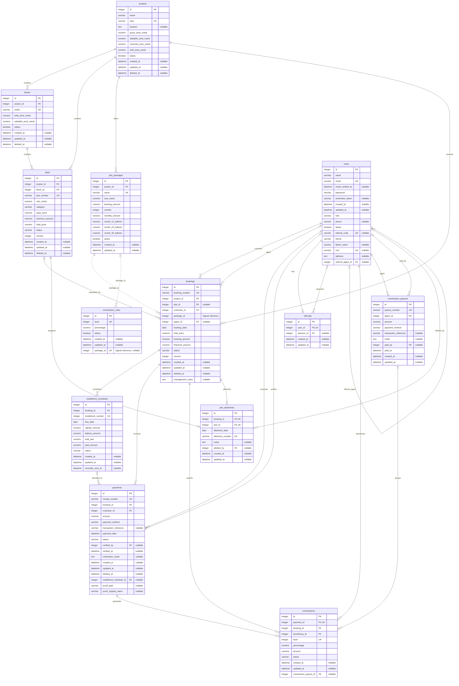

# Database schema diagram

This diagram reflects the current `database/database.sqlite` schema. `PK` means primary key, `FK` means foreign key, and `UK` means a column participating in a unique key. A `?` suffix marks nullable columns.

## Business tables

Dashed relationships are logical references present as columns but not enforced by SQLite foreign-key constraints.

## Authentication, permissions, logging, and framework tables

```mermaid
erDiagram
    permissions {
        integer id PK
        varchar name UK
        varchar guard_name UK
        datetime created_at "nullable"
        datetime updated_at "nullable"
    }
    roles {
        integer id PK
        varchar name UK
        varchar guard_name UK
        datetime created_at "nullable"
        datetime updated_at "nullable"
    }
    model_has_permissions {
        integer permission_id PK,FK
        varchar model_type PK
        integer model_id PK
    }
    model_has_roles {
        integer role_id PK,FK
        varchar model_type PK
        integer model_id PK
    }
    role_has_permissions {
        integer permission_id PK,FK
        integer role_id PK,FK
    }
    activity_log {
        integer id PK
        varchar log_name "nullable"
        text description
        varchar subject_type "nullable"
        integer subject_id "nullable"
        varchar causer_type "nullable"
        integer causer_id "nullable"
        text properties "nullable"
        datetime created_at "nullable"
        datetime updated_at "nullable"
        varchar event "nullable"
        varchar batch_uuid "nullable"
    }
    notifications {
        varchar id PK
        varchar type
        varchar notifiable_type
        integer notifiable_id
        text data
        datetime read_at "nullable"
        datetime created_at "nullable"
        datetime updated_at "nullable"
    }
    password_reset_tokens {
        varchar email PK
        varchar token
        datetime created_at "nullable"
    }
    sessions {
        varchar id PK
        integer user_id "nullable"
        varchar ip_address "nullable"
        text user_agent "nullable"
        text payload
        integer last_activity
    }
    cache {
        varchar key PK
        text value
        integer expiration
    }
    cache_locks {
        varchar key PK
        varchar owner
        integer expiration
    }
    jobs {
        integer id PK
        varchar queue
        text payload
        integer attempts
        integer reserved_at "nullable"
        integer available_at
        integer created_at
    }
    job_batches {
        varchar id PK
        varchar name
        integer total_jobs
        integer pending_jobs
        integer failed_jobs
        text failed_job_ids
        text options "nullable"
        integer cancelled_at "nullable"
        integer created_at
        integer finished_at "nullable"
    }
    failed_jobs {
        integer id PK
        varchar uuid UK
        varchar connection
        varchar queue
        text payload
        text exception
        datetime failed_at
    }
    migrations {
        integer id PK
        varchar migration
        integer batch
    }

    permissions ||--o{ model_has_permissions : assigned
    roles ||--o{ model_has_roles : assigned
    permissions ||--o{ role_has_permissions : included
    roles ||--o{ role_has_permissions : includes
```

Polymorphic columns (`model_type`/`model_id`, `subject_type`/`subject_id`, `causer_type`/`causer_id`, and `notifiable_type`/`notifiable_id`) intentionally have no fixed foreign-key line. The `sessions.user_id` column also has no database-enforced foreign key.
